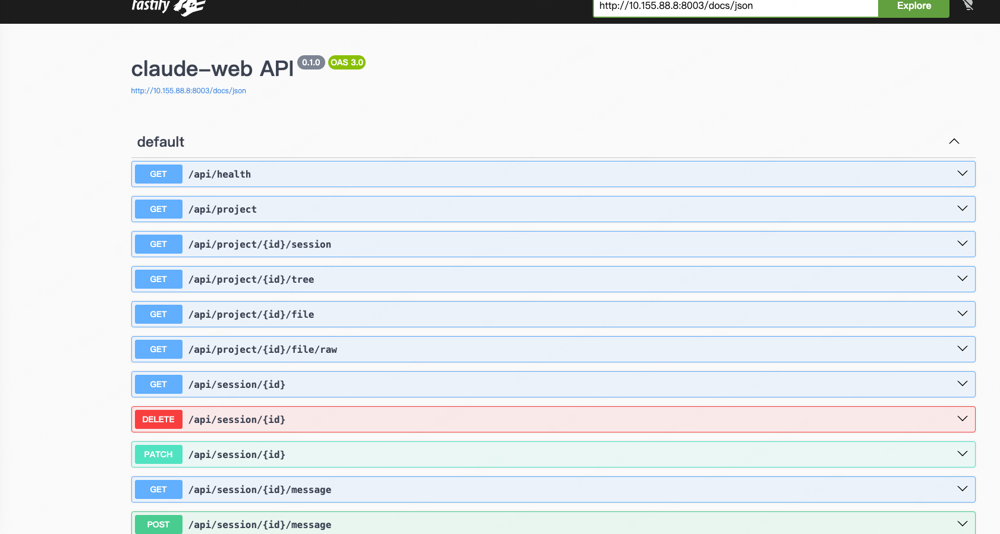
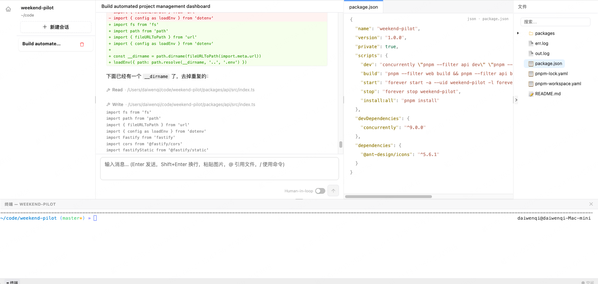

[English](./README.en.md) | 简体中文

# Claude Web

将 [Claude Code Agent SDK](https://www.npmjs.com/package/@anthropic-ai/claude-agent-sdk) 封装为 REST API 服务，并提供开箱即用的 Web 界面。任何语言、任何平台都可以通过 HTTP 接口调用 Claude Code，也可以直接使用 Web 界面与 Claude 对话。

> **前提**：已安装并登录 Claude Code CLI（`claude` 命令可用）

基本使用：

<image src="./preview1.gif" style="margin:0 auto;width:900px;"/>

前端友好，支持粘贴板图片：

<image src="./preview2.gif" style="margin:0 auto;width:900px;"/>

## 快速开始

**1. 安装**

```bash
npm install -g @claude-web/server
```

**2. 启动服务**

可以在任意目录下通过`claude-web start`启动服务：

```bash
claude-web start

→ server: http://127.0.0.1:8003
→ docs: http://127.0.0.1:8003/docs
```

**3. REST API**

Swagger: http://127.0.0.1:8003/docs



1. 查看项目列表

```bash
curl 'http://127.0.0.1:8003/api/project'
# [{"id":"0557d0720cf35f03","cwd":"/Users/daiwenqi/code/echo-bot","sessionCount":0,"updatedAt":0}]
```

2. 新建会话并发送第一条消息（向 `session/new` 发送消息即可自动创建会话，需传入 `cwd`）

```bash
curl -X POST 'http://127.0.0.1:8003/api/session/new/message' \
  -H 'Content-Type: application/json' \
  -d '{"cwd":"/Users/daiwenqi/code/echo-bot","prompt":"你好"}'
```

3. 向已有会话继续发送消息（阻塞模式，也支持 SSE 流式）

```bash
# 阻塞模式：等待 Claude 完成后一次性返回结果
curl -X POST 'http://127.0.0.1:8003/api/session/<sessionId>/message' \
  -H 'Content-Type: application/json' \
  -d '{"prompt":"请帮我列出项目结构"}'

# SSE 流式：实时接收 Claude 的输出
curl -X POST 'http://127.0.0.1:8003/api/session/<sessionId>/message' \
  -H 'Content-Type: application/json' \
  -H 'Accept: text/event-stream' \
  -d '{"prompt":"请帮我列出项目结构"}'
```

## Web 界面

通过 http://127.0.0.1:8003 进入页面，首页显示所有项目，点击某个项目后可以：

- 与 Claude 多轮对话（流式输出）
- 查看项目文件（语法高亮）
- 打开交互式终端
- 通过 `@` 引用项目文件，`/`引用部分预设命令或直接粘贴图片

### 项目主页


### 会话页



## 详细文档

- [packages/server/README.md](./packages/server/README.md) REST API 服务
- [packages/web/README.md](./packages/web/README.md) web ui

## License

MIT
